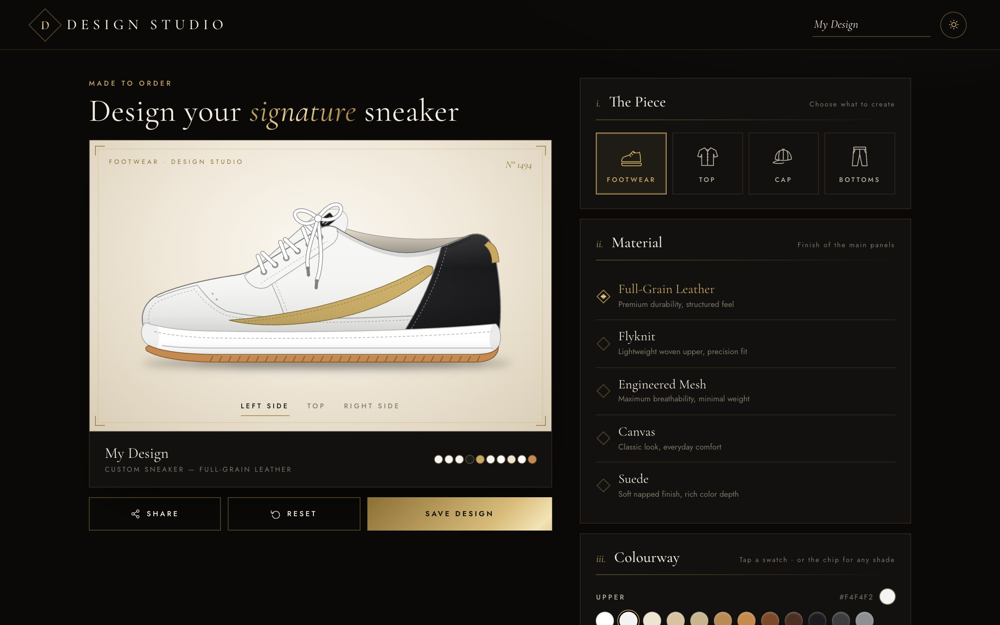
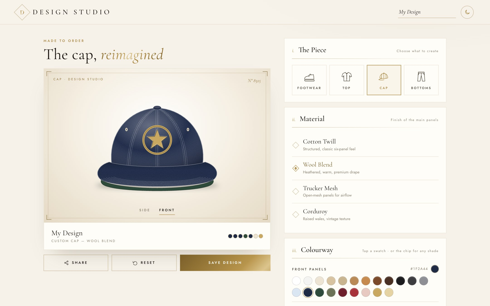
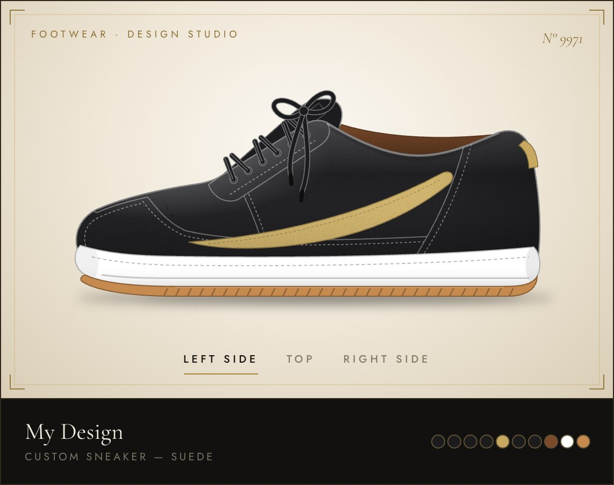
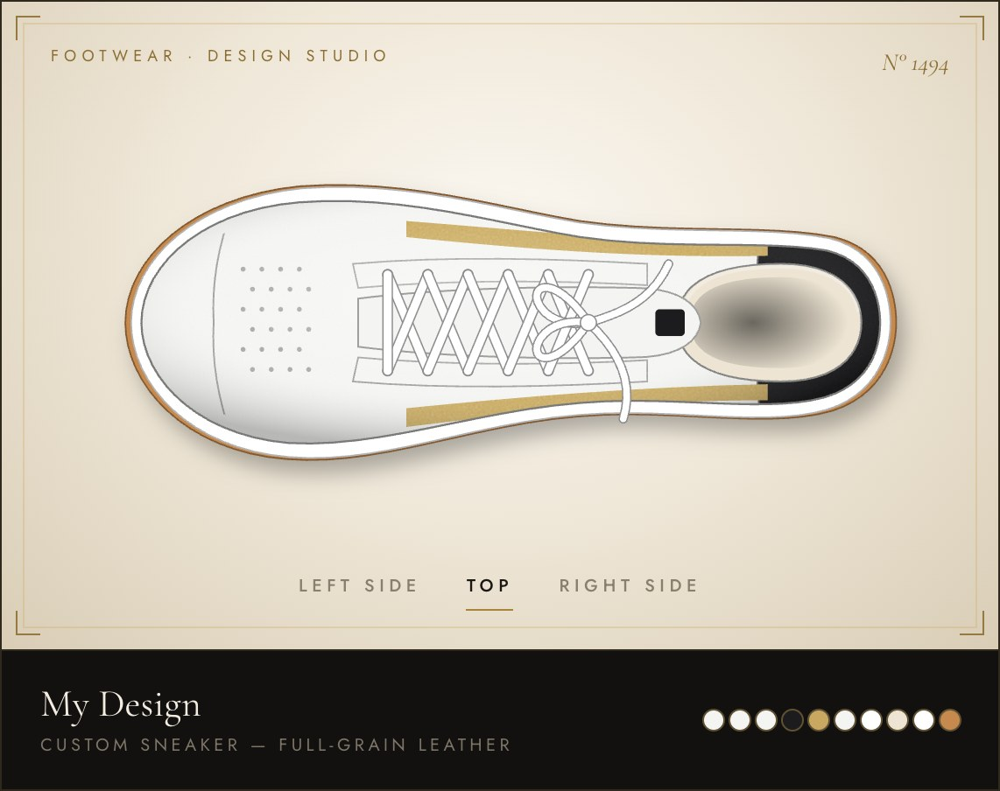
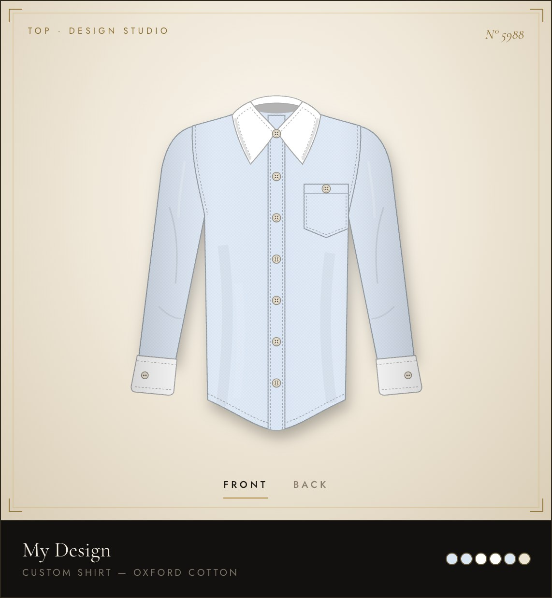
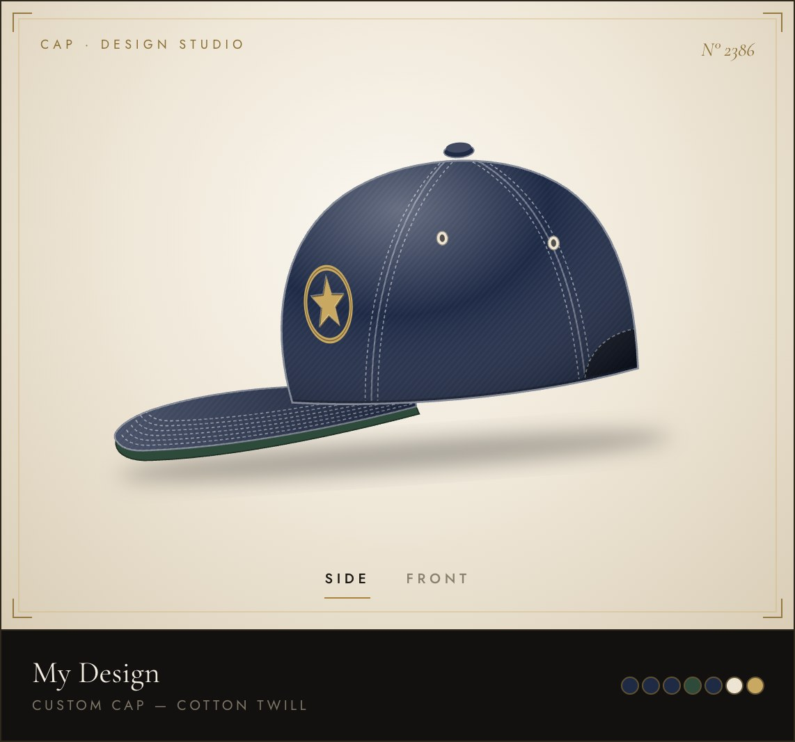
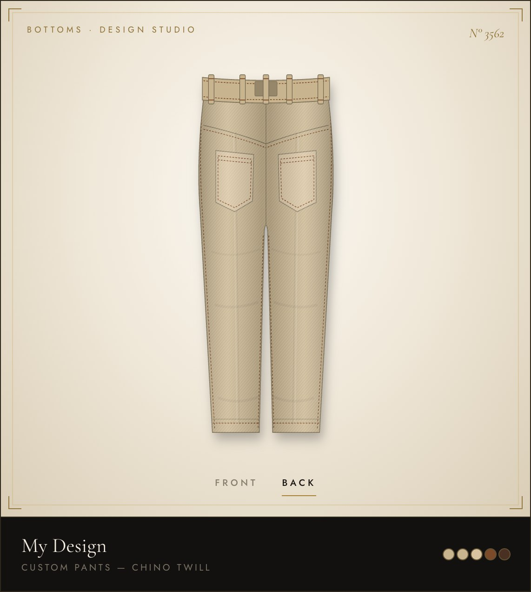
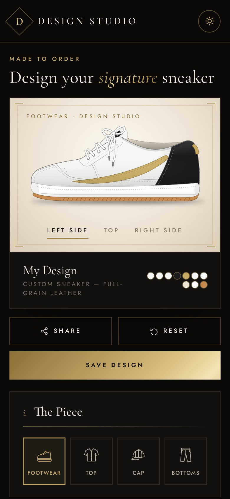

# Design Studio — Product Design Configurator

<div align="center">


**A premium, real-time product customization studio. Design sneakers, shirts, caps and trousers part by part, choose materials, and see every change instantly on a detailed live preview. Save your design and share it with anyone via a unique URL.**

[🚀 Live Demo](https://pdc-client.onrender.com) · [📦 API](https://pdc-server-s19t.onrender.com/api/health) · [🐛 Report Bug](https://github.com/2000090079/product-design-configurator/issues)

</div>

---

## 📸 Screenshots

<div align="center">

**Dark theme: black & gold**



**Light theme: white & gold**



</div>

### The collection

<table>
  <tr>
    <td width="50%"><br/><sub><b>Sneaker:</b> side view, suede, custom colourway</sub></td>
    <td width="50%"><br/><sub><b>Sneaker:</b> top view with criss-cross lacing</sub></td>
  </tr>
  <tr>
    <td width="50%"><br/><sub><b>Shirt:</b> button-up with collar, placket, pocket and cuffs</sub></td>
    <td width="50%"><br/><sub><b>Cap:</b> six-panel with embroidered emblem</sub></td>
  </tr>
  <tr>
    <td width="50%"><br/><sub><b>Trousers:</b> chinos, back view with patch pockets</sub></td>
    <td width="50%" align="center"><br/><sub><b>Mobile:</b> fully responsive layout</sub></td>
  </tr>
</table>

---

## ✨ Features

| Feature | Description |
|---|---|
| 👟 **Four products** | Sneaker, button-up shirt, six-panel cap and chinos, each drawn as detailed SVG |
| 🔄 **Multiple views** | Sneaker left/right/top · shirt and trousers front/back · cap side/front |
| 🎨 **Per-part colours** | Up to 10 independently colourable parts per product (e.g. sneaker upper, mudguard, eyestay, laces, lining, midsole, gum outsole) |
| 🪙 **Curated palette** | 21 refined shades (bone, camel, cognac, onyx, navy, bordeaux, champagne, gold…) plus a custom colour picker for any shade |
| 🧵 **Materials** | Product-specific materials rendered as textures: leather, flyknit, mesh, canvas, suede, oxford, linen, chambray, poplin, flannel, twill, wool, denim, corduroy |
| 🌗 **Dark & light themes** | Black & gold or white & gold with a sun/moon toggle, remembered per browser |
| 🔗 **Share links** | Product, material and every part colour encoded in the URL |
| 💾 **Save** | Persists designs to MongoDB with a unique share ID and read-only share page |
| ♿ **Accessible** | ARIA roles and labels, keyboard navigation, visible focus rings |
| 📱 **Responsive** | Side-by-side on desktop, stacked on mobile |

---|---|
| 🖼️ **Live Preview** | Detailed SVG products (sneaker, button-up shirt, 6-panel cap, chinos) with multiple views |
| 🎨 **Per-Part Colors** | Color every part (e.g. sneaker upper, mudguard, laces, midsole, gum outsole) from curated swatches or any custom color |
| 🧵 **Material Selector** | Product-specific materials (leather, flyknit, mesh, suede, oxford, linen, denim, twill, wool, corduroy…) rendered as textures |
| 👟 **Product Types** | Footwear, Shirts, Caps, and Bottoms |
| 💾 **Save & Share** | Saves to MongoDB, generates a unique shareable URL |
| ♿ **Accessible** | Full ARIA roles, keyboard nav, focus-visible rings |
| 📱 **Responsive** | Stacked on mobile, side-by-side on desktop |

---

## 🗂️ Project Structure

```
product-design-configurator/
├── client/                          # React + TypeScript + Vite
│   └── src/
│       ├── components/
│       │   ├── products/
│       │   │   ├── Shoe.tsx             # Sneaker: side + top views
│       │   │   ├── Shirt.tsx            # Button-up shirt: front + back
│       │   │   ├── Cap.tsx              # Six-panel cap: side + front
│       │   │   ├── Pants.tsx            # Chinos: front + back
│       │   │   └── svgUtils.tsx         # Shading helpers + material textures
│       │   ├── ProductPreview.tsx       # Picks the renderer for the product
│       │   ├── ColorPicker.tsx          # Per-part swatches + custom colour
│       │   ├── MaterialSelector.tsx     # Product-specific materials
│       │   ├── ProductTypeSelector.tsx  # Product picker
│       │   └── ProductIcon.tsx          # Line icons for each product
│       ├── hooks/
│       │   ├── useConfigurator.ts       # Design state, share URL, save
│       │   └── useTheme.ts              # Dark / light theme
│       ├── pages/
│       │   ├── ConfiguratorPage.tsx     # Main studio view
│       │   └── SharedConfigPage.tsx     # Read-only shared design
│       ├── data/options.ts              # Products, parts, materials, palette
│       ├── types/index.ts               # Shared TS interfaces
│       ├── lib/api.ts                   # Env-aware fetch wrapper
│       └── index.css                    # Theme tokens + styles
│
├── server/                          # Node.js + Express + TypeScript
│   └── src/
│       ├── models/Configuration.ts      # Mongoose schema
│       ├── routes/
│       │   ├── configurations.ts        # Save + fetch by share ID
│       │   └── uploads.ts               # Image upload → AWS S3
│       └── index.ts                     # App entry, MongoDB connect
│
├── docs/                            # README screenshots
├── render.yaml                      # Render deploy config
└── package.json                     # Root scripts
```

---

## ⚙️ Tech Stack

### Frontend
- **React 18** — component-based UI with hooks
- **TypeScript** — strict typing across all components
- **CSS custom properties** — dark / light theme tokens
- **Tailwind CSS** — layout utilities
- **SVG** — hand-built product illustrations with texture filters
- **Vite** — lightning-fast dev server and build tool
- **React Router v6** — client-side routing for share links

### Backend
- **Node.js + Express** — REST API server
- **TypeScript** — typed routes, models, middleware
- **Mongoose** — MongoDB ODM with schema validation
- **nanoid** — generates unique 10-char share IDs
- **Multer + AWS S3** — multipart image upload pipeline

### Testing
- **Jest** — unit test runner
- **React Testing Library** — component behavior tests
- **@testing-library/jest-dom** — custom DOM matchers

---

## 🚀 Getting Started

### Prerequisites
- Node.js 18+
- MongoDB (local or Atlas)
- AWS S3 bucket (optional — only for image uploads)

### 1. Clone

```bash
git clone https://github.com/2000090079/product-design-configurator.git
cd product-design-configurator
```

### 2. Install all dependencies

```bash
npm run install:all
```

### 3. Configure environment

```bash
cp server/.env.example server/.env
```

Open `server/.env` and fill in:

```env
PORT=5000
MONGODB_URI=mongodb://localhost:27017/design-configurator

# Optional — only needed for /api/uploads
AWS_ACCESS_KEY_ID=your_key
AWS_SECRET_ACCESS_KEY=your_secret
AWS_REGION=us-east-1
S3_BUCKET_NAME=your-bucket
```

### 4. Start dev servers

```bash
# Terminal 1 — backend
npm run dev:server

# Terminal 2 — frontend
npm run dev:client
```

Open **http://localhost:5173**

---

## 🧪 Testing

```bash
npm test
```

| Test File | Coverage |
|---|---|
| `ProductPreview.test.tsx` | Every product renders in every view; part colours are applied |
| `ColorPicker.test.tsx` | Swatches for all parts, onChange, custom colour input, active state |
| `ProductTypeSelector.test.tsx` | All four products render, aria-pressed, onChange |
| `MaterialSelector.test.tsx` | Materials render, onChange on click |

---|---|
| `ColorPicker.test.tsx` | Renders all colors, aria-selected, onChange |
| `ProductTypeSelector.test.tsx` | All types render, aria-pressed, onChange |
| `MaterialSelector.test.tsx` | All materials render, onChange on click |

---

## 🌐 API Reference

| Method | Endpoint | Description |
|--------|----------|-------------|
| `POST` | `/api/configurations` | Save a design (`productType`: shoe, shirt, cap or pants; per-part `colors`) → returns `shareId` |
| `GET` | `/api/configurations/share/:shareId` | Fetch saved config by share ID |
| `POST` | `/api/uploads` | Upload image to S3 → returns URL |
| `GET` | `/api/health` | Health check |

### Example — Save a configuration

```bash
curl -X POST https://pdc-server-s19t.onrender.com/api/configurations \
  -H "Content-Type: application/json" \
  -d '{
    "productType": "shoe",
    "materialId": "suede",
    "name": "Midnight Gold",
    "colors": {
      "upper": "#1c1c1e",
      "accent": "#c9a961",
      "sole": "#ffffff",
      "outsole": "#c68a4e"
    }
  }'
```

**Response:**
```json
{
  "shareId": "aB3xKp92Lm",
  "_id": "..."
}
```

---

## ☁️ Deployment

Deployed on **Render** using `render.yaml`:

- **Frontend** (Static Site) — auto-deploys on push to `master`
- **Backend** (Web Service) — Node.js, connects to MongoDB Atlas

| Service | URL |
|---|---|
| Frontend | https://pdc-client.onrender.com |
| Backend | https://pdc-server-s19t.onrender.com |

---

<div align="center">
  <sub>Design Studio · built with React, TypeScript and SVG</sub>
</div>
